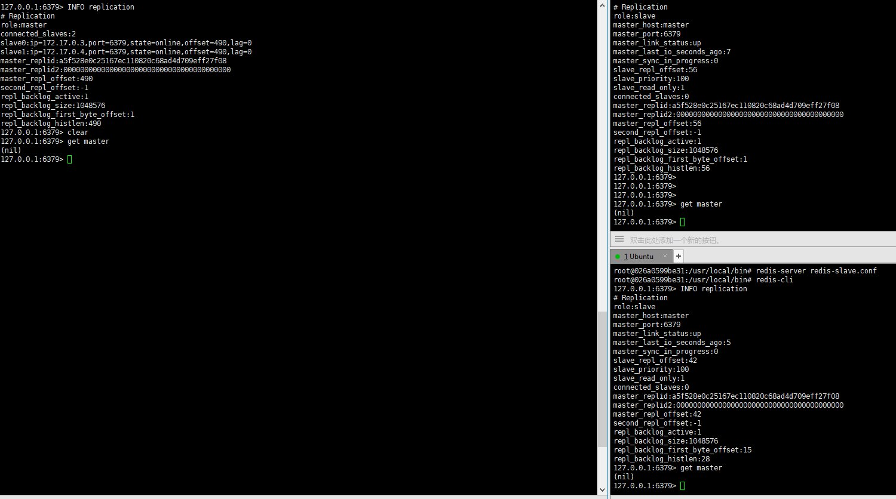
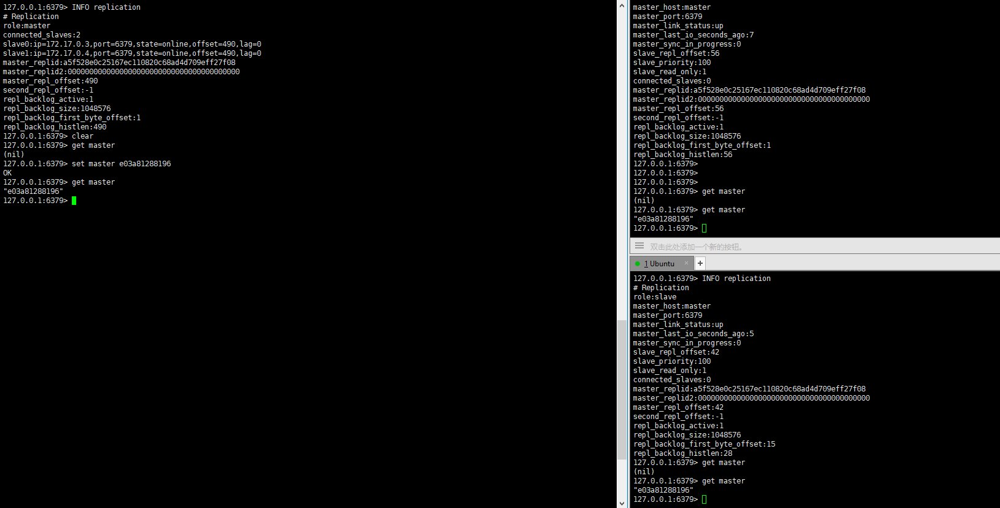

# Docker使用(一)--redis主从同步实现

## 目的

使用容器，使得一个主机和两个备机实现数据同步。

## 实现

### 下载redis容器

```shell
xiaohui@ubuntu:~# docker pull redis
Using default tag: latest
latest: Pulling from library/redis
6ae821421a7d: Already exists 
...
Digest: sha256:dd5b84ce536dffdcab79024f4df5485d010affa09e6c399b215e199a0dca38c4
Status: Downloaded newer image for redis:latest
```

### 启动容器

```shell
# 启动主机容器
xiaohui@ubuntu:~$ docker run -dit --name redis-master redis bash
e03a8128819651a979d4364129e0128286747843aa12a673d20dfb42c01a444a

# 启动两个备机容器
xiaohui@ubuntu:~$ docker run -dit --name redis-slave1 --link redis-master:master redis bash
832edb162d379e813c736da176c278276ac9bee775f337f4c8277b20fb0e8a19
xiaohui@ubuntu:~$ docker run -dit --name redis-slave2 --link redis-master:master redis bash
026a0599be31493e0eca6ba80722e45e7c2a0673fc4966b2aacd5cceda9eec90

xiaohui@ubuntu:~$ docker container ls -a
CONTAINER ID        IMAGE               COMMAND                  CREATED             STATUS              PORTS               NAMES
026a0599be31        redis               "docker-entrypoint.s…"   15 seconds ago      Up 15 seconds       6379/tcp            redis-slave2
832edb162d37        redis               "docker-entrypoint.s…"   21 seconds ago      Up 20 seconds       6379/tcp            redis-slave1
e03a81288196        redis               "docker-entrypoint.s…"   43 seconds ago      Up 42 seconds       6379/tcp            redis-master
```

在启动备机容器时，使用了 **--link** 参数，这样做的好处是：

- 避免容器的IP和端口暴露到外网导致安全问题
- 防止容器在重启后IP发生变化导致访问失效

在备机使用 **--link** 参数后，查看备机容器的 **/etc/hosts** 文件会发现，已经有对应的主机IP映射了。

```shell
# redis-slave1 备机的hosts文件
xiaohui@ubuntu:~$ docker exec -it redis-slave1 bash
root@832edb162d37:/data# cat /etc/hosts
127.0.0.1	localhost
::1	localhost ip6-localhost ip6-loopback
fe00::0	ip6-localnet
ff00::0	ip6-mcastprefix
ff02::1	ip6-allnodes
ff02::2	ip6-allrouters
172.17.0.2	master e03a81288196 redis-master
172.17.0.3	832edb162d37
```

### 启动redis-server

在容器中，为了精简，没有文本编辑的命令，如：vi、nano等。需要使用 **volume** 共享卷的方式，在 **实体机** 上对配置文件进行编辑，然后在容器中从 **/data** 目录下拷贝到指定位置。

#### 查找volume路径

首先需要查找容器的 **volume** 位置，**docker inspect** 可以显示目标容器的低等级的配置信息，配合 **--format** 参数可以查看指定的配置项内容。

```shell
root@ubuntu:~# docker container inspect --format "{{ .Config.Volumes }}" redis-master 
map[/data:{}]
```

使用上面的方式可能没法找到对应的 **Volume** 的位置，可以查找 **Source** 变量。

```shell
root@ubuntu:~# docker container inspect --format "{{ (index .Mounts 0).Source }}" redis-master 
/var/lib/docker/volumes/504da9723a3b47b4b3d3423a52540e9dad5e55b9bb05beb40fc2591abf42d1a9/_data
```

**--format** 需要有Go模板相关的知识，如果不熟悉的话，可以使用 **grep**。

```shell
root@ubuntu:~# docker container inspect redis-master | grep Source
                "Source": "/var/lib/docker/volumes/504da9723a3b47b4b3d3423a52540e9dad5e55b9bb05beb40fc2591abf42d1a9/_data",
```

(虽然不优雅，但是很高效。)

#### 拷贝配置文件并修改

接下来的步骤就是拷贝配置文件，并修改相关配置：

```shell
# cd /var/lib/docker/volumes/504da9723a3b47b4b3d3423a52540e9dad5e55b9bb05beb40fc2591abf42d1a9/_data/
# cp <your-own-redis-dir>/redis-master.conf ./
# nano redis-master.conf
```

`注意：上面的步骤可能需要root权限。`

经过拷贝之后，可以在容器的 **/data** 目录下看见相应的配置文件，但配置文件需要经过一些修改才能使用。

对于 **主机** 来说，配置文件需要修改下面几项内容：

```shell
# bind 127.0.0.1 ::1
protected-mode no
daemonize yes
pidfile /var/run/redis.pid
logfile /usr/local/bin/redis-server.log
dir /usr/local/bin
```

对于 **备机** 来说，除了上面的内容之外，还需要加上 **slaveof master 6379** 这一条。

#### 启动redis服务

接下来的步骤 **主机和备机** 一样。

```shell
# cd /usr/local/bin/
# cp /data/redis.conf ./
# redis-server redis.conf
```

在备机启动后，可以在主机查看备机的连接情况。

```shell
root@e03a81288196:/usr/local/bin# redis-cli
127.0.0.1:6379> info replication
# Replication
role:master
connected_slaves:2
slave0:ip=172.17.0.3,port=6379,state=online,offset=70,lag=1
slave1:ip=172.17.0.4,port=6379,state=online,offset=56,lag=1
master_replid:a5f528e0c25167ec110820c68ad4d709eff27f08
master_replid2:0000000000000000000000000000000000000000
master_repl_offset:70
second_repl_offset:-1
repl_backlog_active:1
repl_backlog_size:1048576
repl_backlog_first_byte_offset:1
repl_backlog_histlen:70
```

可以看到，已经有两台备机连上了。在备机上也可以通过同样的命令查看主机的信息。

```shell
root@832edb162d37:/usr/local/bin# redis-cli
127.0.0.1:6379> INFO replication
# Replication
role:slave
master_host:master
master_port:6379
master_link_status:up
master_last_io_seconds_ago:7
master_sync_in_progress:0
slave_repl_offset:56
slave_priority:100
slave_read_only:1
connected_slaves:0
master_replid:a5f528e0c25167ec110820c68ad4d709eff27f08
master_replid2:0000000000000000000000000000000000000000
master_repl_offset:56
second_repl_offset:-1
repl_backlog_active:1
repl_backlog_size:1048576
repl_backlog_first_byte_offset:1
repl_backlog_histlen:56
```

显示连接的主机 **host为master， 端口为6379**，与配置文件中配置的一致。

## 测试

在开始时，主机和备机上都不含有数据。



在主机上设置后，可以在备机上看到已经同步数据。



----
**2019年 02月 19日 星期二 17:29:49 CST (补充)**

上面的实验也可以通过从新打包redis镜像文件的方式来实现，对应的 **Dockerfile** 内容如下：

```dockerfile
FROM redis

COPY redis-master.conf /usr/local/bin

CMD cd /usr/local/bin && redis-server redis-master.conf && bash
```

build完镜像文件后，只需创建对应的容器就行。

## 参考

- [Redis protected mode](http://blog.51cto.com/crfsz/1878137)
- [redis主备同步配置方法](https://blog.csdn.net/qmhball/article/details/52351755)