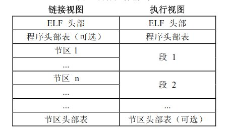
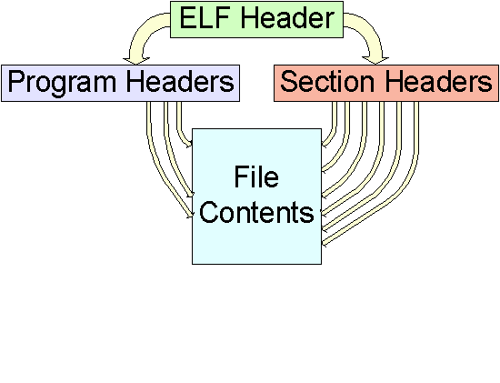
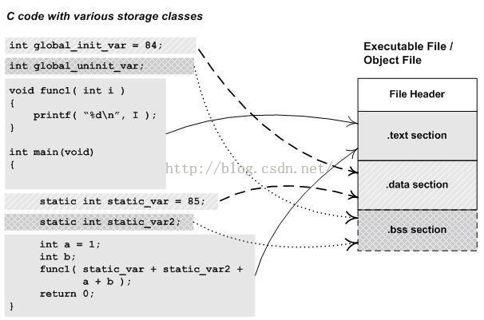
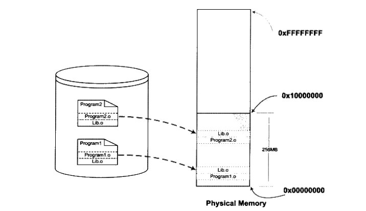
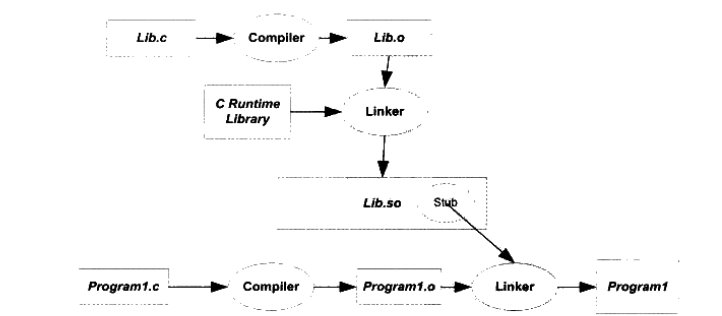
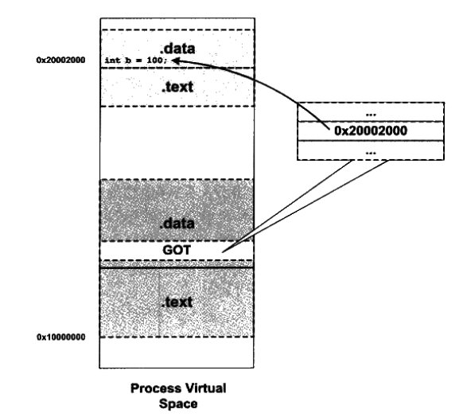

# Elf文件

> 如果把程序从产生到运行比作做菜的话，那么静态的源程序就相当于是菜谱，操作系统相当于是厨师，系统的各种硬件则是炊具，程序加载到内存中运行的整个过程就相当于是烹饪的整个过程。

下面介绍一下菜谱本身的结构。

## 1 简介

**可执行链接格式(Executable and Linking Format)** 最初是由UNIX 系统实验室(UNIX System Laboratories，USL)开发并发布的，作为应用程序二进制接口(Application Binary Interface，ABI)的一部分。

现在PC平台流行的 **可执行链接格式** 主要是Windows下的 **PE(Portable Executable)** 和Linux的 **ELF(Executable Linking Format)**，它们都是 **COFF(Common file format)** 格式的变种。我们现在只讨论Linux平台的ELF文件。

ELF 标准的目的是为软件开发人员提供一组二进制接口定义，这些接口可以延伸到多种操作环境，从而减少重新编码、重新编译程序的需要。接口的内容包括目标模块格式、可执行文件格式以及调试记录信息与格式等。

目标文件有四种类型:

|ELF文件类型|说明|实例|
|:--:|---|---|
|**可重定位文件(Relocatable File)**|包含适合于与其他目标文件链接来创建可执行文件或者共享目标文件的代码和数据。|Linux的.o文件，Windows的.obj文件|
|**可执行文件(Executable File)**|包含适合于执行的一个程序，此文件规定了exec() 如何创建一个程序的进程映像。|比如Linux的/bin/bash，Windows的.exe|
|**共享目标文件(Shared Object File)**|包含可在两种上下文中链接的代码和数据。首先链接编辑器可以将它和其它可重定位文件和共享目标文件一起处理，生成另外一个目标文件。其次，动态链接器(Dynamic Linker)可能将它与某个可执行文件以及其它共享目标一起组合，创建进程映像。|Linux的.so文件，Windows的.dll文件|
|**核心转储文件(Core Dump File)**|当程序意外终止时，系统将该进程的地址空间的内容及终止时的一些其他信息转出到核心转储文件中|Linux下的core dump|

目标文件全部是程序的二进制表示，目的是直接在某种处理器上直接执行。

> 本文不会详细的解释ELF文件的各种参数说明，如想详细了解的话，请查看文末的参考链接，或者查阅elf.h头文件。

## 2 ELF文件结构

**ELF** 文件主要由**ELF头部(ELF Header)**、**程序头部表(Program Header Table)**、**节区(Section)**、 **节区头部表(Section Heade Table)** 组成。

**ELF** 文件分 **链接视图** 和 **执行视图** 两种，执行视图是指程序或动态库加载在内存中的视图，主要是将节区(Section)汇总成段区(Segment)。



- **ELF 头部(ELF Header)** 用来描述整个文件的组织。
- **节区部分(Section)** 包含链接视图的大量信息:指令、数据、符号表、重定位信息等等。
- **程序头部表(Program Header Table)** 如果存在的话，告诉系统如何创建进程映像。 用来构造进程映像的目标文件必须具有程序头部表，可重定位文件(.o文件)不需要这个表。
- **节区头部表(Section Heade Table)** 包含了描述文件节区的信息，每个节区在表中 都有一项，每一项给出诸如节区名称、节区大小这类信息。用于链接的目标文件必须包 含节区头部表，其他目标文件可以有，也可以没有这个表。

> 注意： 尽管图中显示的各个组成部分是有顺序的，实际上除了 ELF 头部表以外， 其他节区和段都没有规定的顺序

### 示例代码

```c
//elfile.c
#include <stdio.h>

int global_init_var = 84;
int global_uninit_var;

void func1(int i)
{
  printf("%d\n",i);
}

int main(){
  static int static_var = 85;
  static int static_var2;
  int a =1;
  int b;
  func1(static_var + static_var2 + a+ b);
  return 0;
}

```

生成动态库

```shell
$ gcc -o elfile elfile.c
```

### ELF头部(ELF Header)

通过readelf命令查看ELF头部

```shell
$ readelf -h elfile
ELF Header:
  Magic:   7f 45 4c 46 01 01 01 00 00 00 00 00 00 00 00 00 
  Class:                             ELF32
  Data:                              2's complement, little endian
  Version:                           1 (current)
  OS/ABI:                            UNIX - System V
  ABI Version:                       0
  Type:                              EXEC (Executable file)
  Machine:                           ARM
  Version:                           0x1
  Entry point address:               0x10318
  Start of program headers:          52 (bytes into file)
  Start of section headers:          7160 (bytes into file)
  Flags:                             0x5000400, Version5 EABI, hard-float ABI
  Size of this header:               52 (bytes)
  Size of program headers:           32 (bytes)
  Number of program headers:         9
  Size of section headers:           40 (bytes)
  Number of section headers:         30
  Section header string table index: 29

```

可以看到**ELF头部**包含了 **ELF魔数**、 **文件及其字节长度**、 **数据存储方式**、 **版本**、 **运行平台**、 **ABI版本**、 **ELF重定位类型**、 **硬件平台**、 **硬件平台版本**、 **入口地址**、 **程序头入口地址和长度**、 **段表的位置和长度**、 **段的数量**等。

我们可以通过程序头部的起始偏移**64**，程序头部的数量**7**，每个程序头部的大小**56bytes**，计算得到程序头部的偏移地址范围为**0x0040----0x01c8**。

通过偏移，我们就能计算程序头部、节区头部的偏移位置，再通过这两个头部就能找到函数的偏移位置。所以，我们要找一个函数的起始地址的过程就变成了 **ELF Header->Program Header->Symbol Section->Function address** 这样的四个步骤。

用一张图表示就是这样。



### 程序头部表(Program Header Table)

```shell
// 通过readelf我们可以查看ELF文件头部表的相关信息
$ readelf -W -l elfile

Elf file type is EXEC (Executable file)
Entry point 0x10318
There are 9 program headers, starting at offset 52

Program Headers:
  Type           Offset   VirtAddr   PhysAddr   FileSiz MemSiz  Flg Align
  EXIDX          0x000534 0x00010534 0x00010534 0x00008 0x00008 R   0x4
  PHDR           0x000034 0x00010034 0x00010034 0x00120 0x00120 R E 0x4
  INTERP         0x000154 0x00010154 0x00010154 0x00019 0x00019 R   0x1
      [Requesting program interpreter: /lib/ld-linux-armhf.so.3]
  LOAD           0x000000 0x00010000 0x00010000 0x00540 0x00540 R E 0x10000
  LOAD           0x000f0c 0x00020f0c 0x00020f0c 0x00124 0x00130 RW  0x10000
  DYNAMIC        0x000f18 0x00020f18 0x00020f18 0x000e8 0x000e8 RW  0x4
  NOTE           0x000170 0x00010170 0x00010170 0x00044 0x00044 R   0x4
  GNU_STACK      0x000000 0x00000000 0x00000000 0x00000 0x00000 RW  0x10
  GNU_RELRO      0x000f0c 0x00020f0c 0x00020f0c 0x000f4 0x000f4 R   0x1

 Section to Segment mapping:
  Segment Sections...
   00     .ARM.exidx 
   01     
   02     .interp 
   03     .interp .note.ABI-tag .note.gnu.build-id .gnu.hash .dynsym .dynstr .gnu.version .gnu.version_r .rel.dyn .rel.plt .init .plt .text .fini .rodata .ARM.exidx .eh_frame 
   04     .init_array .fini_array .jcr .dynamic .got .data .bss 
   05     .dynamic 
   06     .note.ABI-tag .note.gnu.build-id 
   07     
   08     .init_array .fini_array .jcr .dynamic
```

**程序头部(Program Header)**，可执行文件或者共享目标文件的程序头部是一个结构数组，每个结构描述了一个 **段(Segment)** 或者系统准备程序执行所必需的其它信息。

目标文件的 **"段"** 包含一个或者多个 **"节区"**，也就是 **"段内容(Segment Contents)"**。程序头部仅对于可执行文件和共享目标文件有意义。

从**程序头部表**的信息，可以看到一共包含了九个程序头部。

|段名|说明|
|:---:|---|
|**PHDR**| 此类型的段表示程序头表的开始，描述了程序头表的起始地址与占用的字节大小。
|**INTERP**| 此类型的段表示程序**解释器**的位置和长度，通过位置的偏移和长度获取解释器的路径。
|**LOAD**| 表示可以被装载或者映射到内存中，一个可执行文件可以有多个LOAD类型的段。一个需要动态链接的ELF文件通常会有两个LOAD：一个用来存放程序代码的text，一般设置为可读与可执行权限。另一个用来存放全局变量和动态链接信息的data段，设置为可读可写权限。|
|**DYNAMIC**| 包含了动态链接信息，是描述动态段的程序头。动态段中包含了一些标记值和指针，包括以下内容：运行时需要链接的共享库列表、全局偏移表(GOT)的地址、重定位条目的相关信息等。|
|**NOTE**| 记录程序的一些辅助信息。比如程序的类型，程序的所有者，程序的描述。这些信息不参与程序的执行，只有描述作用。|
|**GNU_EH_FRAME**| 保存了一组数据(array element)。数据是在.eh_frame_hdr节中定义的异常处理信息的位置与大小。|
|**GNU_STACK**| 保存了包含堆栈的段的权限，规定了哪些栈是可以执行的。权限设置方式与p_flag相同，缺少这个段意味着堆栈都是可以执行的。|
|**GNU_RELRO**| 这个段内的数据在重定向后是只读的。这个段通常包括了一些动态链接库，包括了.ctors, .dtors, .dynamic, .got 等节。这个段的区域与第二个LOAD段基本重合，只是LOAD 2 段中多了.got、.plt和.data。|

### 节区头部表(Section Heade Table) 和 节区(Section)

```shell
// 通过readelf命令查看节区头部表
$ readelf -W -S ab
There are 30 section headers, starting at offset 0x1bf8:

Section Headers:
  [Nr] Name              Type            Addr     Off    Size   ES Flg Lk Inf Al
  [ 0]                   NULL            00000000 000000 000000 00      0   0  0
  [ 1] .interp           PROGBITS        00010154 000154 000019 00   A  0   0  1
  [ 2] .note.ABI-tag     NOTE            00010170 000170 000020 00   A  0   0  4
  [ 3] .note.gnu.build-id NOTE            00010190 000190 000024 00   A  0   0  4
  [ 4] .gnu.hash         GNU_HASH        000101b4 0001b4 00002c 04   A  5   0  4
  [ 5] .dynsym           DYNSYM          000101e0 0001e0 000050 10   A  6   1  4
  [ 6] .dynstr           STRTAB          00010230 000230 000043 00   A  0   0  1
  [ 7] .gnu.version      VERSYM          00010274 000274 00000a 02   A  5   0  2
  [ 8] .gnu.version_r    VERNEED         00010280 000280 000020 00   A  6   1  4
  [ 9] .rel.dyn          REL             000102a0 0002a0 000008 08   A  5   0  4
  [10] .rel.plt          REL             000102a8 0002a8 000020 08  AI  5  22  4
  [11] .init             PROGBITS        000102c8 0002c8 00000c 00  AX  0   0  4
  [12] .plt              PROGBITS        000102d4 0002d4 000044 04  AX  0   0  4
  [13] .text             PROGBITS        00010318 000318 00020c 00  AX  0   0  4
  [14] .fini             PROGBITS        00010524 000524 000008 00  AX  0   0  4
  [15] .rodata           PROGBITS        0001052c 00052c 000008 00   A  0   0  4
  [16] .ARM.exidx        ARM_EXIDX       00010534 000534 000008 00  AL 13   0  4
  [17] .eh_frame         PROGBITS        0001053c 00053c 000004 00   A  0   0  4
  [18] .init_array       INIT_ARRAY      00020f0c 000f0c 000004 04  WA  0   0  4
  [19] .fini_array       FINI_ARRAY      00020f10 000f10 000004 04  WA  0   0  4
  [20] .jcr              PROGBITS        00020f14 000f14 000004 00  WA  0   0  4
  [21] .dynamic          DYNAMIC         00020f18 000f18 0000e8 08  WA  6   0  4
  [22] .got              PROGBITS        00021000 001000 000020 04  WA  0   0  4
  [23] .data             PROGBITS        00021020 001020 000010 00  WA  0   0  4
  [24] .bss              NOBITS          00021030 001030 00000c 00  WA  0   0  4
  [25] .comment          PROGBITS        00000000 001030 00001f 01  MS  0   0  1
  [26] .ARM.attributes   ARM_ATTRIBUTES  00000000 00104f 00002f 00      0   0  1
  [27] .symtab           SYMTAB          00000000 001080 000740 10     28  91  4
  [28] .strtab           STRTAB          00000000 0017c0 00032c 00      0   0  1
  [29] .shstrtab         STRTAB          00000000 001aec 00010a 00      0   0  1
```

从节区头部表中，可以看到一共含有27个节区。如果说 **段(segment)** 描述了程序在内存中的布局，那么 **节(section)** 包含了具体的数据、代码等信息。

很多节区中包含了程序和控制信息。下面的表中给出了系统使用的节区，以及它们的类型和属性。

|名称|说明|
|:---:|:---|
|**.text**|此节保存了程序代码指令。|
|**.data**|已经初始化的全局变量和局部静态变量(虽然默认会初始化为0,或者手动初始化为0，都没有必要在数据段分配空间，直接放在.bss段，就默认值为0了)都保存在.data段。|
|**.bss** |保存了未进行初始化的全局数据，.bss段只是为未初始化的全局变量和局部静态变量预留位置而已，它并没有内容，所以它在文件中也不占据空间，这样可减少目标文件体积。|
|**.rodata**|存放只读数据，一般是程序里面的只读变量(如const修饰的变量)，以及字符串常量(不一定，也可能放在.data中)。|
|**.got**|**GOT(Global Offset Table)全局偏移表**包含了重定向目标的偏移信息，用来保存**全局变量**引用的地址。
|**.plt**|**PLT(Procedure Linkage Table)过程链接表**包含了动态链接器调用从共享库导入的函数所必须的相关代码。|
|**.got.plt** |用来保存**函数**引用的地址|
|**.rel.plt** **.rel.dyn** |类型为 **SHT_rel** 的重定位表，保存了与重定位相关的信息，这些信息描述了如何在链接或运行时，对ELF目标文件的某部分内容进行补充或修改。**.rel.dyn** 是对数据引用的修正，它所修正的位置位于 **.got**以及数据段， **.rel.plt** 是对函数引用的修正， 它所修正的位置位于 **.got.plt** 。(使用readelf -r 命令可以查看重定位表相关信息)|
|**.gnu.hash** |保存了一个用于查找符号的散列表。|
|**.dynsym** |**动态符号表(Dynamic Symbol Table)** 只保存与动态链接相关的符号。|
|**.dynstr** |**动态字符串表(Dynamic String Table)** 保存了动态符号字符串表，表中存了一系列字符串，代表了符号名称，以空字符为结尾。|
|**.symtab** |**符号表(Symbol Table)** 是一个ElfN_Sym结构(N为32或64，代表不同版本)。 保存了所有的符号，包括了.dynsym中的动态/全局符号。|
|**.strtab**| **字符串表(String Table)** 保存普通的字符串，比如符号的名字。|
|**.shstrtab**| **段表字符串表(String Header String Table)** 保存段表中用到的字符串，如段名。 |

可以简单的表示成下图。



> 程序源代码编译后的机器指令放置在代码段中，如图中的 **.text** 段。已初始化的 **全局变量** 和 **局部静态变量** 的数据已放在数据段中，如图中的 **.data** 段。未初始化的  **全局变量** 和 **局部静态变量**  放置在 **.bss** 段中。 **.bss** 段只是预留位置，并不占据空间。

## 3 链接

与ELF文件有关的链接有两种：

- 将目标文件和源码在编译后链接成成ELF文件，程序运行时不加载其他额外的共享对象，我们称之为 **静态链接(Static Linking)**。
- 共享对象在ELF文件被载入内存期间进行链接，我们称之为 **动态链接(Dynamic Linking)**。

### 静态链接(Static linking)

**静态链接** 的作用主要是将多个目标文件通过静态链接器 **ld** 链接起来，形成一个可执行程序的过程。

我们将使用下面的代码来分析 **静态链接** 的过程。

```c
//a.c
extern int shared;

int main(){
  int a = 100;
  swap(&a, &shared);
}

//b.c
int shared = 1;

void swap(int* a, int* b){
  *a ^= *b ^= *a ^= *b;
}
```

具体操作是，使用 **gcc -c** 命令产生目标文件a.o、b.o，也使用 **ld** 命令将相关的目标文件进行链接。


```shell
$ gcc -c a.c b.c
$ ld a.o b.o -e main -o ab
```

#### 静态链接过程

静态链接过程主要分两步进行：**空间与地址的分配**、 **符号解析和重定位**。

##### 空间与地址的分配

在这一步主要是扫描所有的输入目标文件，获得它们各段的长度、属性和位置，将它们合并，计算出输出文件中各个段合并后的长度和位置，并建立映射关系。除此之外，还会将所有的输入目标文件中的符号表中所有的符号定义和符号引用统一放到一个全局符号表。

通过 **objdump -h** 命令可以查看a.o、b.o、ab链接前后的地址分配情况。

```shell
$ objdump -w -h a.o
节：
Idx Name          Size      VMA               LMA               File off  Algn  标志
  0 .text         00000027  0000000000000000  0000000000000000  00000040  2**0  CONTENTS, ALLOC, LOAD, RELOC, READONLY, CODE
  1 .data         00000000  0000000000000000  0000000000000000  00000067  2**0  CONTENTS, ALLOC, LOAD, DATA
  2 .bss          00000000  0000000000000000  0000000000000000  00000067  2**0  ALLOC
  3 .comment      0000002e  0000000000000000  0000000000000000  00000067  2**0  CONTENTS, READONLY
  4 .note.GNU-stack 00000000  0000000000000000  0000000000000000  00000095  2**0  CONTENTS, READONLY
  5 .eh_frame     00000038  0000000000000000  0000000000000000  00000098  2**3  CONTENTS, ALLOC, LOAD, RELOC, READONLY, DATA
```

```shell
$ objdump -w -h b.o
节：
Idx Name          Size      VMA               LMA               File off  Algn  标志
  0 .text         0000004a  0000000000000000  0000000000000000  00000040  2**0  CONTENTS, ALLOC, LOAD, READONLY, CODE
  1 .data         00000004  0000000000000000  0000000000000000  0000008c  2**2  CONTENTS, ALLOC, LOAD, DATA
  2 .bss          00000000  0000000000000000  0000000000000000  00000090  2**0  ALLOC
  3 .comment      0000002e  0000000000000000  0000000000000000  00000090  2**0  CONTENTS, READONLY
  4 .note.GNU-stack 00000000  0000000000000000  0000000000000000  000000be  2**0  CONTENTS, READONLY
  5 .eh_frame     00000038  0000000000000000  0000000000000000  000000c0  2**3  CONTENTS, ALLOC, LOAD, RELOC, READONLY, DATA
```

```shell
$ objdump -w -h ab
节：
Idx Name          Size      VMA               LMA               File off  Algn  标志
  0 .text         00000071  00000000004000e8  00000000004000e8  000000e8  2**0  CONTENTS, ALLOC, LOAD, READONLY, CODE
  1 .eh_frame     00000058  0000000000400160  0000000000400160  00000160  2**3  CONTENTS, ALLOC, LOAD, READONLY, DATA
  2 .data         00000004  0000000000601000  0000000000601000  00001000  2**2  CONTENTS, ALLOC, LOAD, DATA
  3 .comment      0000002d  0000000000000000  0000000000000000  00001004  2**0  CONTENTS, READONLY
```

可以看到，在目标文件 **a.o** 和 **b.o** 中， **.text** 和 **.data** 等相关节区的初始化地址均为0，在可执行文件 **ab** 中， **.text** 被分配了地址。

##### 符号解析和重定位

在完成空间与地址的分配后，静态链接器就进入了符号解析和重定位步骤。

在这一步，链接器将使用上一步中收集到的信息，读取输入文件中段的数据、重定位的信息，并且进行符号解析与重定位、调整代码中的地址等。

使用 **objdump -d** 命令可以查看目标文件的反汇编结果。

```shell
$ objdump -d a.o
Disassembly of section .text:

0000000000000000 <main>:
   0: 55                    push   %rbp
   1: 48 89 e5              mov    %rsp,%rbp
   4: 48 83 ec 10           sub    $0x10,%rsp
   8: c7 45 fc 64 00 00 00  movl   $0x64,-0x4(%rbp)
   f: 48 8d 45 fc           lea    -0x4(%rbp),%rax
  13: be 00 00 00 00        mov    $0x0,%esi
  18: 48 89 c7              mov    %rax,%rdi
  1b: b8 00 00 00 00        mov    $0x0,%eax
  20: e8 00 00 00 00        callq  25 <main+0x25>
  25: c9                    leaveq
  26: c3                    retq
```

```shell
$ objdump -d ab
Disassembly of section .text:

00000000004000e8 <main>:
  4000e8: 55                    push   %rbp
  4000e9: 48 89 e5              mov    %rsp,%rbp
  4000ec: 48 83 ec 10           sub    $0x10,%rsp
  4000f0: c7 45 fc 64 00 00 00  movl   $0x64,-0x4(%rbp)
  4000f7: 48 8d 45 fc           lea    -0x4(%rbp),%rax
  4000fb: be 00 10 60 00        mov    $0x601000,%esi
  400100: 48 89 c7              mov    %rax,%rdi
  400103: b8 00 00 00 00        mov    $0x0,%eax
  400108: e8 02 00 00 00        callq  40010f <swap>
  40010d: c9                    leaveq
  40010e: c3                    retq

000000000040010f <swap>:
  40010f: 55                    push   %rbp
···
```

可以看到在经过链接器重定位后，目标文件 **a.o** 中反汇编的main函数的第六条和第八条指令所执行的地址已经从0重定位成 **可执行文件** 中对应数据的偏移。例如第八条指令跳转swap函数，跳转的位置正好是下面swap函数开始的位置。

### 动态链接(Dynamic Linking)

早期的一些系统，采用 **静态链接库(Static Shared Library)** 的方式生成可执行文件(注意与 **静态库(Static Library)** 的区别)。 **静态链接库(Static Shared Library)** 的缺点可以简单的用下图表示：



> 可以看到 **Program1** 和 **Program2** 分别包含了 **Lib.o** 目标文件，这样会在内存中存在两份 **Lib.o** 的副本，如果关联到 **Lib.o** 的可执行程序很多的话，会造成很严重的空间浪费。并且如果需要更新 **Lib.o** 的话会非常的麻烦。

**动态链接** 的出现，主要是为了解决 **静态链接(静态链接库方式)** 时产生的空间浪费和更新困难的问题。

**动态链接** 在编译生成可执行文件时，不会将那些组成程序的目标文件进行链接， **链接共享对象** 的过程发生在ELF文件 **载入到内存期间** ，这个过程主要是通过 **ld.so** 库加载与可执行文件相关的动态库到内存中。

基本过程如下图所示:



在谈及Linux下程序的动态链接过程之前，先谈一下与之相关的一些话题。

#### GOT(Global Offset Table)

如果我们把共享对象模块中的地址引用按照是否为跨模块分成两类：**模块内部引用** 和 **模块外部引用**，按照不同的引用方式又可以分成 **指令引用** 和 **数据访问**，那么就有四种情况。

||指令跳转、调用|数据访问|
|:---:|:---|:---|
|**模块内部**|相对跳转和调用|相对地址访问|
|**模块外部**|间接跳转和调用(GOT)|间接访问(GOT)|

> 相关详细内容请参考[《程序员的自我修养》](https://www.amazon.cn/dp/B0027VSA7U)第七章内容。

从上表我们可以看到，模块外部的指令和数据调用都可以通过GOT表跳转。



ELF将GOT拆分成两个表 **".got"**、 **".got.plt"**。其中 **".got"** 用来保存全局变量的引用的地址， **".got.plt"** 用来保存函数引用的地址。

另外 **".got.plt"** 的前三项有特殊的意义：

- 第一项为 **.dynamic段** 的地址
- 第二项为 一个指向内部数据结构的指针，类型是link_map，在动态装载器内部使用，包含了进行符号解析需要的当前ELF对象的信息。
- 第三项为 **_dl_runtime_resolve()** 函数的地址

#### PLT(Procedure Linkage Table)

**过程链接表** 的作用是将位置无关的符号转移到绝对地址。当一个外部符号被调用时，PLT 去引用 GOT 中的其符号对应的绝对地址，然后转入并执行。

```shell
// 使用objdump命令查看.plt节的反汇编代码
$ objdump -d -j .plt libdynamic.so

libdynamic.so：     文件格式 elf64-x86-64


Disassembly of section .plt:

00000000000006a0 <__gmon_start__@plt-0x10>:
 6a0:	ff 35 62 09 20 00    	pushq  0x200962(%rip)        # 201008 <_GLOBAL_OFFSET_TABLE_+0x8>
 6a6:	ff 25 64 09 20 00    	jmpq   *0x200964(%rip)        # 201010 <_GLOBAL_OFFSET_TABLE_+0x10>
 6ac:	0f 1f 40 00          	nopl   0x0(%rax)

00000000000006b0 <__gmon_start__@plt>:
 6b0:	ff 25 62 09 20 00    	jmpq   *0x200962(%rip)        # 201018 <_GLOBAL_OFFSET_TABLE_+0x18>
 6b6:	68 00 00 00 00       	pushq  $0x0
 6bb:	e9 e0 ff ff ff       	jmpq   6a0 <_init+0x20>

00000000000006c0 <_ZNSt8ios_base4InitC1Ev@plt>:
 6c0:	ff 25 5a 09 20 00    	jmpq   *0x20095a(%rip)        # 201020 <_GLOBAL_OFFSET_TABLE_+0x20>
 6c6:	68 01 00 00 00       	pushq  $0x1
 6cb:	e9 d0 ff ff ff       	jmpq   6a0 <_init+0x20>

00000000000006d0 <__cxa_atexit@plt>:
 6d0:	ff 25 52 09 20 00    	jmpq   *0x200952(%rip)        # 201028 <_GLOBAL_OFFSET_TABLE_+0x28>
 6d6:	68 02 00 00 00       	pushq  $0x2
 6db:	e9 c0 ff ff ff       	jmpq   6a0 <_init+0x20>

00000000000006e0 <__cxa_finalize@plt>:
 6e0:	ff 25 4a 09 20 00    	jmpq   *0x20094a(%rip)        # 201030 <_GLOBAL_OFFSET_TABLE_+0x30>
 6e6:	68 03 00 00 00       	pushq  $0x3
 6eb:	e9 b0 ff ff ff       	jmpq   6a0 <_init+0x20>

```

PLT表结构有以下特点：

- PLT表中的第一项为公共表项，剩下的是每个动态库函数为一项(当然每项是由多条指令组成的，jmp *0xXXXXXXXX这条指令是所有plt的开始指令)。
- 每项PLT都从对应的GOT表项中读取目标函数地址。

#### 延迟绑定(Lazy Binging)

**动态库** 比 **静态库** 慢的主要原因在于动态库在加载时，对于全局和静态的数据访问都要进行复杂的 **GOT重定位** 操作；对于模块间的调用也要先定位GOT，然后再进行间接跳转。

如果可执行文件调用的动态库函数很多，那在进程初始化时都会对这些函数做地址解析和重定位工作，大大增加进程的启动时间。

所以ELF采用了一种 **延迟重绑定** 机制，只有动态库函数在被第一次调用时，才会进行绑定(符号查找、重定位等)，如果没有用到则不进行绑定。

##### 延迟绑定过程

```shell
00000000000006e0 <__cxa_finalize@plt>:
 6e0:	ff 25 4a 09 20 00    	jmpq   *(__cxa_finalize@got)        # 201030 <_GLOBAL_OFFSET_TABLE_+0x30>
 6e6:	68 03 00 00 00       	pushq  $0x3
 6eb:	e9 b0 ff ff ff       	jmpq   6a0 <_init+0x20>
```

**__cxa_finalize@plt** 的第一条指令是通过GOT间接跳转的指令(为了方便讲解，已将地址替换为符号)。**__cxa_finalize@plt** 保存的是函数相应的项。

为了实现延迟绑定，链接器在初始化阶段并没有将对应的函数地址填入到该项，而是将上述代码中的第二条指令 **"pushq  $0x3"** 的地址填入到 **__cxa_finalize@plt** 中。

```shell
//使用readelf查看本地ELF文件中.got节的内容
$ readelf -x .got libdynamic.so

“.got”节的十六进制输出：
  0x00200fd0 00000000 00000000 00000000 00000000 ................
  0x00200fe0 00000000 00000000 00000000 00000000 ................
  0x00200ff0 00000000 00000000 00000000 00000000 ................
```

最后执行第三条指令，跳转到 **__gmon_start__@plt-0x10**，里面实现的是 **_dl_runtime_resolve()** 函数，此函数主要是用来完成符号解析和重定位工作。

一旦函数被解析完毕，当我们再次调用 **__cxa_finalize@plt** 时，第一条指令就能直接跳转到真正的函数中，而不会在继续往下执行。

下图展示的是 **延迟绑定** 的执行过程。


##### 程序执行时的链接过程

对于通过 **静态链接** 所产生的可执行文件来说，首先操作系统会读取可执行文件的头部，检查文件的合法性，然后从 **Program Header** 中 读取每个 **Segment** 的虚拟地址、文件地址和属性，将它们映射到进程的虚拟地址空间，然后操作系统就可以把控制权转交给可执行文件的入口地址，然后程序开始执行。

> 操作系统→加载可执行程序→控制权交给可执行程序

对于通过 **动态链接** 产生的可执行文件来说，前半部分与上述内容基本一致，但当操作系统加载完可执行文件后，还有很多外部符号的引用处于无效地址状态。所以，此时操作系统不会将控制权转交给可执行文件，而是先启动一个 **动态链接器(Dynamic Linker)** 。在Linux下，动态链接器为 **ld.so** ，加载完动态链接器后，操作系统将控制权转交给动态链接器。之后，动态链接器开始执行一系列自身的初始化操作，然后对可执行文件和与之关联的共享对象进行链接。当所有的链接工作完成以后，动态链接器再将控制权转交给可执行文件的入口地址，然后程序开始执行。

> 操作系统→加载可执行程序→控制权交给动态链接器→动态链接器链接共享对象→控制权交给可执行程序

## 相关参考

- [Gcc 编译的背后](https://github.com/tinyclub/open-c-book/blob/master/zh/chapters/02-chapter2.markdown#toc_27212_14734_14)
- [动态符号链接的细节](https://github.com/tinyclub/open-c-book/blob/master/zh/chapters/02-chapter4.markdown#toc_23258_14315_6)
- [Executable and Linkable Format (ELF)](http://www.skyfree.org/linux/references/ELF_Format.pdf)
- [Elf文件格式(北京大学实验室出的标准版)](https://download.csdn.net/download/jiangwei0910410003/9204051)
- [聊聊Linux动态链接中的PLT和GOT（4）—— 穿针引线](https://blog.csdn.net/linyt/article/details/51893258)
- [《程序员的自我修养》](https://www.amazon.cn/dp/B0027VSA7U)

