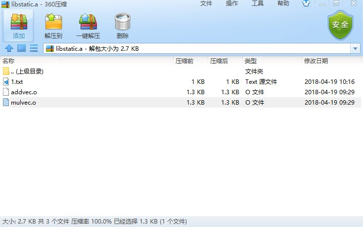
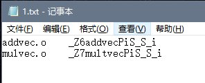
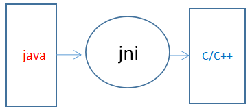

# 编译

> 如果把程序从产生到运行比作做菜的话，那么静态的源程序就相当于是菜谱，操作系统相当于是厨师，系统的各种硬件则是炊具，程序加载到内存中运行的整个过程就相当于是烹饪的整个过程。

下面介绍一下菜谱的制作过程，以及两道特色菜 **静态库** 和 **动态库**。

## 1 编译

linux上可执行程序的生成，简单来说经历了下面几个步骤:

- 预处理(**Preprocessing**)
- 编译(**Compilation**)
- 汇编(**Assembly**)
- 链接(**Linking**)

下面将从这几个步骤介绍可执行程序的生成过程。


### 1.1 示例代码

```c
#include <stdio.h>

int main(){
    printf("Hello World!\n");
}
```

### 1.2 预处理(**Preprocessing**)

不同的源码文件，可能引用同一个头文件(比如stdio.h)。编译的时候，头文件也必须一起编译。为了节省时间，编译器会在编译源码之前，先编译头文件。这保证了头文件 **只需编译一次** ，不必每次用到的时候，都重新编译了。

预处理过程主要是处理那些源代码文件中以"#"开始的预编译命令。比如 **#include**、**#define**等，主要处理规则如下：

- 将所有的 **#define** 删除，并展开所有的宏定义。
- 处理所有的条件预编译指令，如 **#if**、 **#ifdef**、 **#elif**、 **#else**、 **#endif**。
- 处理 **#include** 预编译指令，将被包含的文件插入到该预编译指令的位置。值得注意的是，此过程采用的是 **广度优先** 递归进行，相同的头文件只会处理一次。
- 删除所有的注释 **//** 和 **/\*\*/**。
- 保留所有的 **#pragma** 编译器指令，编译器需要使用。

gcc使用 **-E** 参数实现预处理过程。

```shell
$ gcc -E main.c -o main.i
```

经过**预处理器(CPP)** 处理后，只是对源文件进行了扩展。得到的**main.i** 文件。

```c
···
extern int ftrylockfile (FILE *__stream) __attribute__ ((__nothrow__ , __leaf__)) ;


extern void funlockfile (FILE *__stream) __attribute__ ((__nothrow__ , __leaf__));
# 942 "/usr/include/stdio.h" 3 4

# 3 "main.c" 2


# 4 "main.c"
int main(){
    printf("Hello World!\n");
}
```

### 1.3 编译(**Compilation**)

在这个阶段中，主要是把预处理完的文件进行一系列 **词法分析**、 **语法分析** 、**语义分析** 及 **优化**，产生相应的汇编代码文件。

gcc使用 **-S** 参数实现编译过程。

```shell
$ gcc -S main.i -o main.s
```

**main.s**的内容为汇编语言程序。

```c
    .file       "main.c"
    .section    .rodata
.LC0:
    .string     "Hello World!"
    .text
    .globl      main
    .type       main, @function
main:
.LFB0:
    .cfi_startproc
    pushq       %rbp
    .cfi_def_cfa_offset 16
    .cfi_offset 6, -16
    movq        %rsp, %rbp
    .cfi_def_cfa_register 6
    movl        $.LC0, %edi
    call        puts
    movl        $0, %eax
    popq        %rbp
    .cfi_def_cfa 7, 8
    ret
    .cfi_endproc
.LFE0:
    .size       main, .-main
    .ident      "GCC: (Ubuntu 5.4.0-6ubuntu1~16.04.9) 5.4.0 20160609"
    .section    .note.GNU-stack,"",@progbits
```

### 1.4 汇编(**Assembly**)

**汇编器(AS)** 将**main.s** 中的汇编语言指令转变为机器可以执行的指令，每一条汇编语句对应一条或多条机器指令，生成**可重定位文件main.o**(本系列未特殊指明类型的话，指的是ELF类型的文件)。

gcc使用 **-c** 参数实现编译过程。

```shell
$ gcc -c main.s -o main.o

$ nm main.o
0000000000000000 T main
                 U puts
```

可以看到，这一过程产生的文件中，main函数的地址并没有确定，需要进行链接步骤。

### 1.5 链接(**Linking**)

**链接程序(LD)** 将**main.o** 和一些其他必要的目标文件组合起来，创建可执行目标文件。

- 各个中间文之间的同名section合并
- 对代码段，数据段以及各符号进行地址分配
- 链接时重定位修正

```shell
$ gcc -o main main.o

$ nm main
···
000000000040052d T main
                 U puts@@GLIBC_2.2.5
···
```

我们现在所说的链接过程其实仍属于的是 **"静态"链接** 的范畴，main函数的相对地址已经确定，但printf对应的puts函数的地址需要在运行时从动态链接库glic中查找，此时需要 **"动态"链接**。

> **"静态"链接** 是程序开发阶段程序员用 **ld(gcc 实际上在后台调用了 ld)静态链接器**手动链接的过程，而 **"动态"链接** 则是程序运行期间系统调用 **动态链接器(ld-linux.so)** 自动链接的过程。具体参考[《动态符号链接的细节》](https://github.com/tinyclub/open-c-book/blob/master/zh/chapters/02-chapter4.markdown#toc_23258_14315_6)。

运行./main，程序加载并运行

```shell
$ ./main
Hello World!
```

生成的**main.o** 和**main** 都为ELF格式。

> 注:以上步骤可以只通过 **gcc -o main main.c** 实现

## 2. 共享库

**共享库**是一种将库函数打包成一个单元使之能够在运行时被多个进程共享的技术。主要有**静态库**和**动态库**两种。

|共享库|优点|缺点|
|:---:|:---:|:---:|
|静态库|在编译过程中已经被载入可执行程序，编译后的执行程序不需要外部的函数库支持。不会发生应用程序在 不同 Linux 版本下的标准库不兼容问题。|代码在编译过程中已经被载入可执行程序，因此体积较大。|
|动态库|代码是在可执行程序运行时才载入内存的，在编译过程中仅简单的引用，因此代码体积较小。|比较容易发生应用程序在不同 Linux 版本下标准库依赖不兼容问题。|

### 2.1 示例代码

```c
// addvec.h
void addvec(int* x, int* y, int*z, int n);

// addvec.cpp
#include "addvec.h"
void addvec(int* x, int* y, int*z, int n)
{
    int i=0;
    for(; i< n;++i)
        z[i] = x[i] + y[i];
}
```

```c
// mulvec.h
void multvec(int*x, int* y, int*  z, int n);

// mulvec.cpp
#include "mulvec.h"
void multvec(int*x, int* y, int*  z, int n)
{
    int i = 0;
    for(; i < n; ++i)
        z[i] = x[i] * y[i];
}
```

```c
// main.cpp
#include <iostream>
#include "addvec.h"

int x[2] = {1, 2};
int y[2] = {3, 4};
int z[2] = {0};

int main() {
    addvec(x, y, z, 2);
    std::cout << "z = [" << z[0] << " " << z[1] << "]\n" << std::endl;
    return 0;
}
```

### 2.2 静态库(archive)

**静态库** 也被称为归档文件，它是UNIX系统提供的第一种库。

- 可以将一组经常被用到的目标文件组织进单个库文件，这样就可以使用它来构建多个可执行程序并且在构建各个应用程序的时候无需重新编译原来的源代码文件。
- 链接命令变得更加简单。在链接命令行中只需要指定静态库的名称即可，而无需一个个的列出目标文件。

#### 2.2.1 创建静态库

```shell
$ gcc -c addvec.cpp mulvec.cpp            # 产生.o重定位文件
$ ar r libstatic.a addvec.o  mulvec.o     # 生成静态库文件libstatic.a
```

查看静态库中的目录表

```shell
$ ar tv libstatic.a
rw-r--r-- 0/0   1344 Apr 19 09:29 2018 addvec.o
rw-r--r-- 0/0   1344 Apr 19 09:29 2018 mulvec.o
```

删除静态库中的一个模块

```shell
$ ar d libstatic.a mulvec.o
$ ar tv libstatic.a
rw-r--r-- 0/0   1344 Apr 19 09:29 2018 addvec.o
```

使用归档文件打开器打开静态库文件后可以看见内部的结构。



打开**1.txt** 文件可以看见相关函数的信息。



#### 2.2.2 使用静态库

第一种，直接链接。

```shell
$ g++ -o main_static main.cpp ./libstatic.a
$ ./main_static
z = [4 6]
```

第二种，从指定目录链接(编译时添加 **-L**选项)。

```shell
$ g++ -o main_static main.cpp -L./lib -lstatic  # 从本地的lib目录下链接libstatic.a静态库
$ ./main_static
z = [4 6]
```

> 注意，一般情况下GCC、G++会优先使用动态库作为链接选项，所以当**libstatic.so**和**libstatic.a**同时存在时，会优先使用**libstatic.so**。要想只使用静态库进行链接，需要使用参数 **-static**。

```shell
$ g++ -o main_static main.cpp -L./lib -static -lstatic
```

相关编译选项请参考:[gcc编译选项](http://www.shanghai.ws/gnu/gcc_1.htm)、[GCC 参数详解](http://www.cppblog.com/SEMAN/archive/2005/11/30/1440.html)或者 ***man gcc***

### 2.3 动态库

将程序与静态库链接起来时，得到的可执行文件会包含所有的被链接进程序的目标文件的副本。当几个不同的可执行程序使用了同样的目标模块时，每个执行程序会拥有自己的目标模块的副本。就会造成一些问题:

- 存储同一个目标模块的多个副本严重浪费磁盘空间.
- 使用同一模块的程序在同一时刻运行，每一程序会在虚拟内存中保存一份目标模块的副本，提高了系统虚拟内存的使用量。
- 修改静态库的一个目标模块，需要重新链接静态库文件以合并这个更改。

动态库的设计用来解决以上的问题。动态库的关键思想是目标模块的**单个副本由所有需要这些模块的程序共享**。目标模块不会复制到链接过的可执行文件中。

动态库的另一种用法是作为**Java Native Interface(JNI)** 中的构建块，它允许Java代码通过调用动态库中的**C/C++** 函数直接访问底层操作系统的特性。



#### 2.3.1 动态库创建

##### 2.3.1.1 一般动态库创建

```shell
$ g++ -fPIC -Wall -c addvec.cpp mulvec.cpp
$ g++ -g -shared -o libdynamic.so addvec.o mulvec.o
```

通过上面过程，产生了**libdynamic.so** 动态库，相关参数解释如下:

- ***-fPIC***(**Position Independent Code**): 位置独立的代码。作用于编译阶段，告诉编译器产生与位置无关代码。**没有绝对地址，全部使用相对地址**，故而代码可以被加载器加载到内存的任意位置，都可以正确的执行。这正是共享库所要求的，共享库被加载时，在内存的位置不是固定的。
- ***-Wall***: 打开所有警告
- ***-g***: 在编译的时候，产生调试信息。
- ***-shared***: 生成共享目标文件。

##### 2.3.1.2 带soname的动态库

上述的动态库中所使用的都为动态库的真是名称。但是还有一种常用的做法是——使用别名来创建动态库，这种别名称为**soname**(ELF文件中的 中的DT_SONAME标签)。

- 如果动态库拥有一个soname，那么链接阶段会将soname嵌入到可执行文件中，同时之后在运行时程序也会使用这个soname来搜索库。
- 引入soname的目的是为了提供一层中间层，方便后续动态库的更新，版本的变化。

```shell
# 使用soname选项编译
$ g++ -g -shared -Wl,-soname,libdy.so -o libdynamic.so addvec.o mulvec.o

# 使用readelf查看动态库后，发现多了一个SONAME标签
$ readelf -d libdynamic.so

Dynamic section at offset 0xdd8 contains 28 entries:
  标记        类型                         名称/值
 0x0000000000000001 (NEEDED)             共享库:[libstdc++.so.6]
 0x0000000000000001 (NEEDED)             共享库:[libm.so.6]
 0x0000000000000001 (NEEDED)             共享库:[libgcc_s.so.1]
 0x0000000000000001 (NEEDED)             共享库:[libc.so.6]
 0x000000000000000e (SONAME)             Library soname: [libdy.so]
 ···

# 编译可执行程序，仍使用动态库的真是名称
$ g++ -g -Wall -o main_dynamic main.cpp ./lib/libdynamic.so

# 使用readelf查看可执行程序，依赖的共享库为libdy.so
$ readelf -d main_dynamic

Dynamic section at offset 0xde8 contains 28 entries:
  标记        类型                         名称/值
 0x0000000000000001 (NEEDED)             共享库:[libdy.so]
 0x0000000000000001 (NEEDED)             共享库:[libstdc++.so.6]
 0x0000000000000001 (NEEDED)             共享库:[libm.so.6]
 0x0000000000000001 (NEEDED)             共享库:[libgcc_s.so.1]
 0x0000000000000001 (NEEDED)             共享库:[libc.so.6]
 ···
  
# 调用动态库时，提示错误:libdy.so未找到
$ LD_LIBRARY_PATH=./lib/ ./main_dynamic 
./main_dynamic: error while loading shared libraries: libdy.so: cannot open shared object file: No such file or directory

# 需要软链接连接libdy.so至libdynamic.so
$ ln -s libdynamic.so libdy.so

# 再次运行
$ LD_LIBRARY_PATH=./lib/ ./main_dynamic
z = [4 6]
```

#### 2.3.2 动态库使用

动态库的调用主要有两种方式，**静态链接**和 **动态加载**。

- 一种是动态地将程序和共享库链接并让 Linux 在执行时加载库(如果它已经在内存中了，则无需再加载)。
- 一种是通过**dlopen API**在程序需要的时候，先加载一个特定的库(已加载则不必)，然后调用该库中的某一特定函数。

不管是**静态链接**还是**动态加载**，在运行时，所依赖的库文件的搜索路径都是按照一定顺序来查找的。

1. 编译目标代码时指定的动态库搜索路径 **rpath**，编译过程中指定
2. 环境变量 **LD_LIBRARY_PATH** 指定的动态库搜索路径，运行时指定
3. 配置文件 **/etc/ld.so.conf** 中指定的动态库搜索路径
4. 默认的动态库搜索路径/lib
5. 默认的动态库搜索路径/usr/lib

> 后两项不同系统会有所不同

##### 2.3.2.1 静态链接(Static Linking)

###### 2.3.2.1.1 可执行程序链接动态库

使用g++编译可执行程序时，将动态库一起链接上。

```shell
$ g++ -g -Wall -o main_dynamic main.cpp libdynamic.so
```

使用**readelf** 命令查看**main_dynamic**，会显示程序所依赖的动态库信息。

```shell
$ readelf -d  main_dynamic

Dynamic section at offset 0xde8 contains 28 entries:
  标记        类型                         名称/值
 0x0000000000000001 (NEEDED)             共享库:[libdynamic.so]
 0x0000000000000001 (NEEDED)             共享库:[libstdc++.so.6]
 0x0000000000000001 (NEEDED)             共享库:[libm.so.6]
 0x0000000000000001 (NEEDED)             共享库:[libgcc_s.so.1]
 0x0000000000000001 (NEEDED)             共享库:[libc.so.6]
 ···
```

###### 2.3.2.1.3 运行程序

直接调用**main_dynamic** 会提示错误: libdynamic.so未找到。

```shell
$ ./main_dynamic
./main_dynamic: error while loading shared libraries: libdynamic.so: cannot open shared object file: No such file or directory
```

调用动态库时，有两种方式。

- 一种是在调用可执行程序时，设置环境变量**LD_LIBRARY_PATH**为动态库的位置。

```shell
$ LD_LIBRARY_PATH=./lib ./main_dynamic 
z = [4 6]
```

- 一种是在编译时，通过**rpath**选项指定运行时搜索动态库的位置。

```shell
# 指定main_dynamic在执行时搜索./lib目录下的libdynamic.so
$ g++ -g -Wall -Wl,-rpath=./lib/ -o main_dynamic main.cpp ./lib/libdynamic.so

# 通过readelf命令可以发现，多了一个RPATH标签
$ readelf -d main_dynamic

Dynamic section at offset 0xdd8 contains 29 entries:
  标记        类型                         名称/值
 0x0000000000000001 (NEEDED)             共享库:[libdynamic.so]
 0x0000000000000001 (NEEDED)             共享库:[libstdc++.so.6]
 0x0000000000000001 (NEEDED)             共享库:[libm.so.6]
 0x0000000000000001 (NEEDED)             共享库:[libgcc_s.so.1]
 0x0000000000000001 (NEEDED)             共享库:[libc.so.6]
 0x000000000000000f (RPATH)              Library rpath: [./lib/]
···

# 再次调用main_dynamic，只要./lib目录下含有对应的动态库文件，则能够成功执行
$ ./main_dynamic
z = [4 6]
```

##### 2.3.2.2 动态加载(Dynamic Loading)

动态加载指的是可执行程序开始运行之后，动态链接器不加载依赖的动态库，在需要的时候通过**dlopen API**的接口加载所需的动态库。具体请参考下一节的**dlopen API**。

### 2.4 dlopen API

**动态加载** 支持程序在运行时控制自己加载的模块,并且可以在不需要的时候随时卸载。这种加载模块的方式很灵活，可以用来实现一些诸如插件、驱动等功能。

**dlopen** 主要**API** 有以下几个。

|函数名|作用|
|:--:|:--|
|***dlopen()***|打开一个动态库，返回一个供后续调用的|
|***dlsym()***|在动态库中搜索一个符号(一个包含函数或变量的字符串)并返回其地址|
|***dlclose()***|关闭由dlopen()打开的库|
|***dlerror()***|返回一个错误消息字符串|

#### 2.4.1 dlopen()

```c
#include <dlfcn.h>

void *dlopen(const char *libfilename, int mode);
```

如果**libfilename**包含 **'/'**，dlopen会将其解释成一个绝对或者相对的路径名称。否则，会按照上一节提到的顺序搜索。

**mode**为打开动态库的模式，主要使用两种模式: ***RTLD_LAZY***、***RTLD_NOW***。

- ***RTLD_LAZY***: 只有当代码被执行的时候才解析库中未定义的函数符号。
- ***RTLD_NOW***: 在**dlopen()** 结束之前立即加载动态库中所有的未定义的符号，不管是否需要用到这些符号。这种模式下打开库的速度变慢了，但能立即检测到任何潜在的未定义函数符号错误。

函数返回值为 **ELF** 对象的句柄。

#### 2.4.2 dlsym()

```c
#include <dlfcn.h>

void *dlsym(void *handle, char *symbol);
```

通过 **dlopen()** 函数获取到 **ELF** 对象的句柄后，通过调用 **dlsym()** 函数在handle指向的库以及该库的依赖树中的库中搜索名为**symbol**的符号(函数或变量)。

如果找到了**symbol**，则返回对应的地址，否则返回NULL。

- 如果**symbol**是一个变量的名称，可以将**dlsym()**的返回值赋给一个合适的指针类型，并通过反引用改指针来得到变量的值

```c
int *ip

ip = (int *)dlsym(handle, symbol);
if (ip != NULL)
    printf("Value is %d\n", *ip);
```

- 如果**symbol**是一个函数的名称，可以使用**dlsym()**的返回的指针来调用该函数。

```c
int (*funcp)(int);  # 定义函数指针

*(void **)(&funcp) = dlsym(handle, symbol);    # 获取函数
res = (*funcp)(arg);        # 函数使用
```

#### 2.4.3 dlclose()

```c
#include <dlfcn.h>

int dlclose(void *handle);
```

- **dlclose()** 函数会减小**handle** 所引用的库的打开引用的系统计数。
- 如果计数为0，并且其他库都不需要用到该库中的符号了，那么就会卸载这个库。
- 系统会在这个库的依赖树中的库执行(递归地)同样的过程。
- 当进程终止时会隐式地对所有的库执行**dlclose()**。

#### 2.4.4 dlerror()

```c
#include <dlfcn.h>

const char *dlerror();
```

当调用**dlopen API**的过程中得到了一个错误，那么可以使用**dlerror()** 来获取一个指向表明错误原因的字符串的指针。

#### 2.4.5 C++ Name Mangling

在C++程序里，所有的non-static函数都是以二进制文件symbols来表示。这些symbols都是些特殊的文本字符串，都是唯一的在程序中。

```shell
# 使用nm命令查看动态库文件时，显示函数名附加了别的内容，所以dlsym函数无法通过"addvec"找到对应函数
$ nm libdynamic.so
···
0000000000000a50 T _Z6addvecPiS_S_i
0000000000000ac0 T _Z7multvecPiS_S_i
···
```

然而在C语言中，函数的symbol名字就是函数名字本身，例如 **strcpy** 的symbol就是 **strcpy**，所以在C语言中不会有中non-static函数出现重名情况。

由于C++有很多C语言没有的功能，例如class、函数的overloading、异常处理等等，所以symbol不可能简单的以函数名来定。

为了解决这个问题，C++提出了**name mangling**，这个name mangling的功能就是把function的名字转换成只有编译器知道的奇怪字符串，利用该函数所有的已知信息，如果函数参数的类型，个数，函数等等，所有如果函数名字为 **foo(int， char)**，利用name mangling之后，其名字可能是 **foo_int_char** 或者其他字符串也说不定。

> 在C＋＋标准里中还没有定义这个函数名是被怎样的mangled的，每个编译器都有自己的一套方法。

处理方式是添加 ***extern "C"*** 标识。

```c++
// addvec.h
extern "C"
{
    void addvec(int *x, int *y, int *z, int n);
}

// addvec.cpp
#include "addvec.h"


extern "C" void addvec(int *x, int *y, int *z, int n) {
    int i = 0;
    for (; i < n; ++i)
        z[i] = x[i] + y[i];
}
```

添加了**extern "C"** 编译后的动态库文件

```shell
$ nm libdynamic.so
···
00000000000006c5 T addvec           # addvec的symbol为函数名
···
0000000000000735 T _Z7multvecPiS_S_i    # mulvec的symbol仍为之前
···
```

#### 2.4.6 使用动态加载

修改main函数如下:

```c++
// main.cpp
#include <dlfcn.h>
#include <string>
#include <iostream>

int x[2] = {1, 2};
int y[2] = {3, 4};
int z[2] = {0};

int main(int argc, char *argv[]) {

    void *dl_handle;
    float (*func)(int *, int *, int *, int);
    char *error;

    // 打开动态库文件，获取句柄
    dl_handle = dlopen("../libdynamic.so", RTLD_NOW);
    if (!dl_handle) {
        std::cout << "!!! " << dlerror() << std::endl;
        return 0;
    }

    // 根据函数名查找函数地址，C++需要注意name mangling的问题
    *(void **) (&func) = dlsym(dl_handle, "addvec");
    error = dlerror();
    if (error != nullptr) {
        std::cout << "!!! " << dlerror() << std::endl;
        return 0;
    }

    // 执行获取的函数
    (*func)(x, y, z, 2);
    std::cout << "z = [" << z[0] << " " << z[1] << "]\n" << std::endl;

    // 结束句柄
    dlclose(dl_handle);

    return 0;
}
```

### 2.5 动态库初始化和终止函数

可以定义**一个**或**多个**在共享库被加载和卸载时自动执行的函数，使之能在使用共享库时就能完成一些初始化和终止工作。

不管库是自动被加载还是使用**dlopen** 接口显示加载，初始化和终止函数都会被执行。

```c
# 在addvec.h中添加初始化和终止函数声明
extern "C"
{
    void addvec(int *x, int *y, int *z, int n);
    void __attribute__((constructor)) x_init(void);
    void __attribute__((destructor)) x_fini(void);
}

# 在addvec.cpp中添加初始化和终止函数实现
#include "addvec.h"
#include <iostream>

extern "C" void addvec(int *x, int *y, int *z, int n) {
    int i = 0;
    for (; i < n; ++i)
        z[i] = x[i] + y[i];
}

extern "C" void __attribute__((constructor)) x_init(void) {
    std::cout << "void __attribute__((constructor)) x_init(void) execute!!" << std::endl;
}

extern "C" void __attribute__((destructor)) x_fini(void) {
    std::cout << "void __attribute__((constructor)) x_fini(void) execute!!" << std::endl;

}
```

通过**nm**命令查看动态库中的相关函数名，新增了**x_fini**、**xinit**函数。

```shell
$ nm libdynamic.so
···
0000000000000a15 T addvec
0000000000000ae1 T x_fini
0000000000000a85 T x_init
0000000000000b9a T _Z7multvecPiS_S_i
···
```

调用可执行程序，会在开始和终止时调用对应的函数。

```shell
$ ./main_dynamic
void __attribute__((constructor)) x_init(void) execute!!
z = [4 6]

void __attribute__((constructor)) x_fini(void) execute!!
```

> 注：用于完成共享库的初始化和终止工作的一项较早的技术是在库中创建两个函数 **_init()** 和 **_finit()**。但构建共享库时必须指定**gcc -nostartfiles**选项，或者使用 **-Wl,-init**和 **-Wl,-finit** 链接器选项来指定函数的名称。不过有了gcc的**constructor**和**destructor**特性之后已经不建议使用。

## 3 动态库相关工具介绍

### 3.1 ldd

***ldd*** 内部实现为**shell**命令，用于打印程序或者库文件所依赖的共享库列表。

```shell
$ldd libdynamic.so
linux-vdso.so.1 =>  (0x00007fff9b57b000)
libstdc++.so.6 => /lib64/libstdc++.so.6 (0x00007f9ec959a000)
libm.so.6 => /lib64/libm.so.6 (0x00007f9ec9298000)
libgcc_s.so.1 => /lib64/libgcc_s.so.1 (0x00007f9ec9081000)
libc.so.6 => /lib64/libc.so.6 (0x00007f9ec8cbe000)
/lib64/ld-linux-x86-64.so.2 (0x0000558c095f8000)
```

### 3.2 objdump

**objdump** 命令是用查看目标文件或者可执行的目标文件的构成的gcc工具。

- **-f** 显示文件头信息。
- **-D** 反汇编所有section (-d反汇编特定section)。
- **-h** 显示目标文件各个section的头部摘要信息。
- **-x** 显示所有可用的头信息，包括符号表、重定位入口。-x 等价于 -a -f -h -r -t 同时指定。
- **-i** 显示对于 -b 或者 -m 选项可用的架构和目标格式列表。
- **-r** 显示文件的重定位入口。如果和-d或者-D一起使用，重定位部分以反汇编后的格式显示出来。
- **-R** 显示文件的动态重定位入口，仅仅对于动态目标文件有意义，比如某些共享库。
- **-S** 尽可能反汇编出源代码，尤其当编译的时候指定了-g这种调试参数时，效果比较明显。隐含了-d参数。
- **-t** 显示文件的符号表入口。类似于nm -s提供的信息。

### 3.3 readelf

**readelf**命令用来显示一个或者多个elf格式的目标文件的信息。主要参数:

- **-a** 全部信息，等价于: -h -l -S -s -r -d -V -A -I
- **-h** 文件头信息，显示ELF文件的文件头 Display the ELF file header
- **-l** 程序头信息，显示程序的头部信息
- **-S** 段头信息，显示段头信息
- **-d** 显示动态段，如果存在的话

```shell
# 显示可执行程序的头部信息
$ readelf -h main_dynamic
ELF 头:
  Magic:  7f 45 4c 46 02 01 01 00 00 00 00 00 00 00 00 00
  Class:                             ELF64
  Data:                              2's complement, little endian
  Version:                           1 (current)
  OS/ABI:                            UNIX - System V
  ABI Version:                       0
  Type:                              EXEC (可执行文件)      # 根据不同类型的文件会显示不同的type
  Machine:                           Advanced Micro Devices X86-64
  Version:                           0x1
  入口点地址:                        0x4009c6
  程序头起点:                        64 (bytes into file)
  Start of section headers:          27448 (bytes into file)
  标志:                              0x0
  本头的大小:                        64 (字节)
  程序头大小:                        56 (字节)
  Number of program headers:         9
  节头大小:                          64 (字节)
  节头数量:                          37
  字符串表索引节头:                   34
```

```shell
# 显示程序头信息
$ readelf -l main_dynamic

Elf 文件类型为 EXEC (可执行文件)
入口点 0x4009c6
共有 9 个程序头，开始于偏移量64

程序头:
  Type           Offset             VirtAddr           PhysAddr           FileSiz            MemSiz              Flags  Align
  PHDR           0x0000000000000040 0x0000000000400040 0x0000000000400040 0x00000000000001f8 0x00000000000001f8  R E    8
  INTERP         0x0000000000000238 0x0000000000400238 0x0000000000400238 0x000000000000001c 0x000000000000001c  R      1
  [Requesting program interpreter: /lib64/ld-linux-x86-64.so.2]
  LOAD           0x0000000000000000 0x0000000000400000 0x0000000000400000 0x0000000000000cbc 0x0000000000000cbc  R E    200000
  LOAD           0x0000000000000db8 0x0000000000600db8 0x0000000000600db8 0x00000000000002d4 0x0000000000000408  RW     200000
  DYNAMIC        0x0000000000000dd8 0x0000000000600dd8 0x0000000000600dd8 0x0000000000000220 0x0000000000000220  RW     8
  NOTE           0x0000000000000254 0x0000000000400254 0x0000000000400254 0x0000000000000044 0x0000000000000044  R      4
  GNU_EH_FRAME   0x0000000000000b64 0x0000000000400b64 0x0000000000400b64 0x000000000000003c 0x000000000000003c  R      4
  GNU_STACK      0x0000000000000000 0x0000000000000000 0x0000000000000000 0x0000000000000000 0x0000000000000000  RW     10
  GNU_RELRO      0x0000000000000db8 0x0000000000600db8 0x0000000000600db8 0x0000000000000248 0x0000000000000248  R      1

 Section to Segment mapping:
  段节...
   00
   01     .interp
   02     .interp .note.ABI-tag .note.gnu.build-id .gnu.hash .dynsym .dynstr .gnu.version .gnu.version_r .rela.dyn .rela.plt .init .plt .text .fini .rodata .eh_frame_hdr .eh_frame
   03     .init_array .fini_array .jcr .dynamic .got .got.plt .data .bss
   04     .dynamic
   05     .note.ABI-tag .note.gnu.build-id
   06     .eh_frame_hdr
   07
   08     .init_array .fini_array .jcr .dynamic .got
```

```shell
# 显示段头信息
$ readelf -S main_dynamic
共有 37 个节头，从偏移量 0x6b38 开始:

节头:
  [Nr] Name              Type             Address           Offset       Size              EntSize          Flags  Link  Info  Align
  [ 0]                   NULL             0000000000000000  00000000     0000000000000000  0000000000000000           0     0     0
  [ 1] .interp           PROGBITS         0000000000400238  00000238     000000000000001c  0000000000000000   A       0     0     1
  [ 2] .note.ABI-tag     NOTE             0000000000400254  00000254     0000000000000020  0000000000000000   A       0     0     4
  [ 3] .note.gnu.build-i NOTE             0000000000400274  00000274     0000000000000024  0000000000000000   A       0     0     4
  [ 4] .gnu.hash         GNU_HASH         0000000000400298  00000298     0000000000000028  0000000000000000   A       5     0     8
  [ 5] .dynsym           DYNSYM           00000000004002c0  000002c0     0000000000000198  0000000000000018   A       6     1     8
  [ 6] .dynstr           STRTAB           0000000000400458  00000458     00000000000001a4  0000000000000000   A       0     0     1
  [ 7] .gnu.version      VERSYM           00000000004005fc  000005fc     0000000000000022  0000000000000002   A       5     0     2
  ···
```

### 3.4 nm

**nm**命令被用于显示二进制目标文件的符号表。

- **-A** 每个符号前显示文件名。
- **-D** 显示动态符号。
- **-g** 仅显示外部符号。
- **-r** 反序显示符号表。

```shell
$ nm main_dynamic
000000000060108c B __bss_start
00000000006011b0 b completed.6354
                 U __cxa_atexit@@GLIBC_2.2.5
0000000000601078 D __data_start
0000000000601078 W data_start
00000000004009f0 t deregister_tm_clones
                 U dlclose@@GLIBC_2.2.5
                 U dlerror@@GLIBC_2.2.5
                 U dlopen@@GLIBC_2.2.5
                 U dlsym@@GLIBC_2.2.5
0000000000400a60 t __do_global_dtors_aux 
···
```

### 3.5 ldconfig

**ldconfig**命令的用途主要是在默认搜寻目录/lib和/usr/lib以及动态库配置文件/etc/ld.so.conf内所列的目录下，搜索出可共享的动态链接库(格式如lib*.so*)，进而创建出动态装入程序(ld.so)所需的连接和缓存文件。

缓存文件默认为 **/etc/ld.so.cache**，此文件保存已排好序的动态链接库名字列表，为了让动态链接库为系统所共享，需运行动态链接库的管理命令ldconfig。

```shell
# ldconfig参数说明
$ ldconfig --help
用法: ldconfig [选项...]
Configure Dynamic Linker Run Time Bindings.

  -c, --format=FORMAT        采用的格式:新、旧或兼容(默认)
  -C CACHE                   将 CACHE 用作缓冲区文件
  -f CONF                    将 CONF 用作配置文件
  -i, --ignore-aux-cache     忽略辅助缓存文件
  -l                         手工连接独立的库。
  -n
                             只在命令行中给出了进程目录。未创建缓冲区。
  -N                         不要创建缓冲区
  -p, --print-cache          打印缓冲区
  -r ROOT                    进入 ROOT 目录并将其作为根目录
  -v, --verbose              生成详细消息
  -X                         不要生成连接
  -?, --help                 给出该系统求助列表
      --usage                给出简要的用法信息
  -V, --version              打印程序版本号

长选项的强制或可选参数对对应的短选项也是强制或可选的。
```

## 4 相关参考

- [从源代码到可执行文件——编译全过程解析](http://lxwei.github.io/posts/262.html)
- [gcc参数详解](http://www.cppblog.com/SEMAN/archive/2005/11/30/1440.html)
- [gcc,g++-GNU工程的C和C++编译器(egcs-1.1.2)](http://www.shanghai.ws/gnu/gcc_1.htm)
- [Linux GCC常用命令](http://www.cnblogs.com/ggjucheng/archive/2011/12/14/2287738.html)
- [动态符号链接的细节](https://github.com/tinyclub/open-c-book/blob/master/zh/chapters/02-chapter4.markdown#toc_23258_14315_6)
- [Linux 动态库剖析](https://www.ibm.com/developerworks/cn/linux/l-dynamic-libraries/index.html)
- [C++使用dlsym错误解释](http://www.cplusplus.com/forum/unices/5257/)
- [如何在运行时加载C＋＋函数和类](https://blog.csdn.net/wzhg0508/article/details/46282973)
- [Linux命令查询](http://man.linuxde.net)
- [Android逆向之旅---Android应用的汉化功能(修改SO中的字符串内容)](https://blog.csdn.net/jiangwei0910410003/article/details/49361281)
- [Redirecting-functions-in-shared-ELF-libraries](https://www.codeproject.com/Articles/70302/Redirecting-functions-in-shared-ELF-libraries#_Toc257815978)

