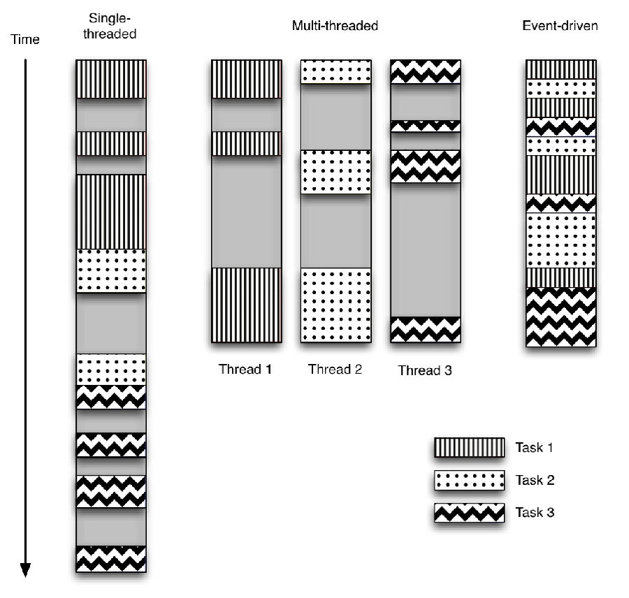

# 同步与异步

一般编写代码时，习惯的是按照流程一步一步的往下执行。对于CPU密集型程序而言，这种方式很适合，不会浪费过多的CPU使用时间。但对于I/O密集型程序，大部分时间在等待IO操作执行完成，造成了许多CPU空闲时间。

为了避免在进行I/O密集型操作时，CPU空闲时间过长的问题，可以使用多线程、多进程(与CPU核数相关)、异步协程的方式解决。

下面这张图很详细的说明了多线程、协程在I/O密集型程序执行时，CPU的使用情况：



单线程处理多个I/O请求时，会按照顺序执行任务，当任务进行I/O请求时，线程会等待I/O请求结束，然后继续运行。这样就造成了过多的时间浪费。

多线程的思路是，使用不同的线程执行不同的任务，当某个线程进行I/O请求时，别的线程仍可以使用CPU资源进行各自的操作。但这种方式在生产线程和销毁线程的时候，会有时间的消耗，虽然这部分的时间很短，但当线程数量达到一定程度时，这部分时间也是不可忽略的部分了。

python中异步协程的处理方式是根据事件的响应进行，当某个任务进行I/O操作时，并不会等待I/O操作结束，而是进行另外的一个任务，当之前的I/O操作结束时，触发I/O操作结束事件，于是协程开始继续处理I/O操作。

协程的好处在于：在单线程的基础上，充分利用了CPU的空闲时间。

`(注意：协程对于I/O密集型程序十分有效，但对于CPU密集型程序效果不好。)`

## python协程

在Python中，不同版本的协程使用方式有所不同，在 **2.x** 版本，使用的是 **gevent** 模块。在 **3.x** 版本，又新增了两种方式：

- **asynico + yield from(python3.4)**
- **asynico + await(python3.5)**

python协程中有些十分重要的概念：

- **event_loop 事件循环**：程序开启一个无限的循环，程序员会把一些函数注册到事件循环上。当满足事件发生的时候，调用相应的协程函数。
- **coroutine 协程**：协程对象，指一个使用async关键字定义的函数，它的调用不会立即执行函数，而是会返回一个协程对象。协程对象需要注册到事件循环，由事件循环调用。
- **task  任务**：一个协程对象就是一个原生可以挂起的函数，任务则是对协程进一步封装，其中包含任务的各种状态。
- **future**： 代表将来执行或没有执行的任务的结果。它和task上没有本质的区别
- **async/await 关键字**：python3.5 用于定义协程的关键字，async定义一个协程，await用于挂起阻塞的异步调用接口。

### event_loop

**event_loop** 是pyhton异步程序的入口，协程函数通过在事件循环中注册，事件循环则会在合适的时间调用协程函数。

#### 事件策略

**事件策略** 是事件循环的生产者，这点可以从 **events.py** 的函数中看出。

```python
# events.py
def get_event_loop():
    current_loop = _get_running_loop()
    if current_loop is not None:
        return current_loop
    return get_event_loop_policy().get_event_loop()
```

如上面的源码，在默认的获取事件循环的函数中，是通过 **get_event_loop_policy** 得到事件策略后，再通过 **get_event_loop** 获取事件循环。

**asyncio** 在不同的系统平台选择不同的策略，用户不用关系所使用的具体策略。策略

#### 事件循环

## 实验

下面的内容是分别通过协程